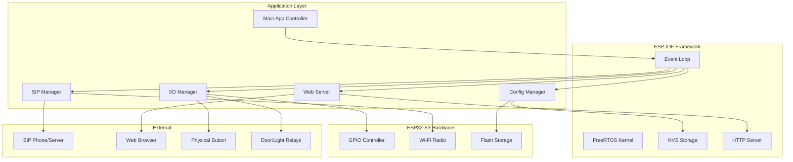

# Design Document

## Overview

The ESP32 SIP Door Station is designed as a modular embedded system built on ESP-IDF framework. The architecture follows a component-based approach where each major functionality (SIP handling, GPIO control, web server, configuration management) is implemented as separate modules with well-defined interfaces. The system operates as a state machine that transitions between idle, calling, and connected states while maintaining real-time responsiveness for both physical and virtual interactions.

The design leverages ESP32-S3's dual-core architecture with FreeRTOS to handle concurrent operations: SIP protocol handling, web server requests, GPIO monitoring, and DTMF processing. All components communicate through event-driven patterns using ESP-IDF's event loop system.

## Architecture

### System Architecture Diagram



### Core Components

1. **Main Application Controller**: Orchestrates system initialization, manages application state machine, and coordinates inter-component communication
2. **SIP Manager**: Handles SIP protocol operations using esp_sip library, manages call states, and processes DTMF tones
3. **I/O Manager**: Controls GPIO operations for button input and relay outputs, provides hardware abstraction layer
4. **Web Server**: Serves configuration interface and virtual controls using esp_http_server
5. **Configuration Manager**: Manages persistent settings using NVS, handles environment variable integration

## Components and Interfaces

### SIP Manager Component

**Responsibilities:**
- Initialize and configure SIP client using esp_sip library
- Manage SIP registration with configured server
- Handle outgoing call initiation and termination
- Process incoming DTMF tones during active calls
- Maintain call state and provide status to other components

**Key Interfaces:**
```c
typedef enum {
    SIP_STATE_IDLE,
    SIP_STATE_REGISTERING,
    SIP_STATE_REGISTERED,
    SIP_STATE_CALLING,
    SIP_STATE_CONNECTED,
    SIP_STATE_ERROR
} sip_state_t;

esp_err_t sip_manager_init(sip_config_t *config);
esp_err_t sip_manager_start_call(const char *uri);
esp_err_t sip_manager_end_call(void);
sip_state_t sip_manager_get_state(void);
esp_err_t sip_manager_register_dtmf_callback(dtmf_callback_t callback);
```

**Events Published:**
- `SIP_EVENT_REGISTERED`: SIP client successfully registered
- `SIP_EVENT_CALL_STARTED`: Outgoing call initiated
- `SIP_EVENT_CALL_CONNECTED`: Call answered by remote party
- `SIP_EVENT_CALL_ENDED`: Call terminated
- `SIP_EVENT_DTMF_RECEIVED`: DTMF tone received with digit data

### I/O Manager Component

**Responsibilities:**
- Configure and monitor doorbell button GPIO with debouncing
- Control door and light relay GPIOs with safety timers
- Provide hardware abstraction for virtual I/O operations
- Implement relay protection logic (pulse timing, toggle states)

**Key Interfaces:**
```c
typedef enum {
    RELAY_DOOR = 0,
    RELAY_LIGHT = 1
} relay_id_t;

typedef enum {
    RELAY_STATE_OFF = 0,
    RELAY_STATE_ON = 1
} relay_state_t;

esp_err_t io_manager_init(void);
esp_err_t io_manager_pulse_relay(relay_id_t relay, uint32_t duration_ms);
esp_err_t io_manager_toggle_relay(relay_id_t relay);
relay_state_t io_manager_get_relay_state(relay_id_t relay);
esp_err_t io_manager_register_button_callback(button_callback_t callback);
```

**Events Published:**
- `IO_EVENT_BUTTON_PRESSED`: Physical or virtual doorbell button activated
- `IO_EVENT_RELAY_STATE_CHANGED`: Relay state modified with relay ID and new state

### Web Server Component

**Responsibilities:**
- Serve static HTML/CSS/JS files from embedded filesystem
- Provide REST API endpoints for configuration and control
- Handle WebSocket connections for real-time status updates
- Implement virtual doorbell and relay status display

**Key API Endpoints:**
```
GET  /                          # Main configuration interface
GET  /api/config                # Current configuration (masked sensitive data)
POST /api/config                # Update configuration
GET  /api/status                # System and relay status
POST /api/doorbell              # Trigger virtual doorbell
GET  /api/relays                # Current relay states
WS   /ws                        # WebSocket for real-time updates
```

**WebSocket Message Format:**
```json
{
    "type": "relay_status",
    "data": {
        "door": "off",
        "light": "on"
    }
}
```

### Configuration Manager Component

**Responsibilities:**
- Load configuration from environment variables at build time
- Manage runtime configuration persistence using NVS
- Provide secure storage for sensitive credentials
- Validate configuration parameters and provide defaults

**Configuration Structure:**
```c
typedef struct {
    char wifi_ssid[32];
    char wifi_password[64];
    char sip_user[32];
    char sip_domain[64];
    char sip_password[64];
    char sip_callee[64];
    uint16_t web_port;
    uint32_t door_pulse_duration;
} door_station_config_t;
```

**Key Interfaces:**
```c
esp_err_t config_manager_init(void);
esp_err_t config_manager_load(door_station_config_t *config);
esp_err_t config_manager_save(const door_station_config_t *config);
esp_err_t config_manager_validate(const door_station_config_t *config);
esp_err_t config_manager_factory_reset(void);
```

## Data Models

### System State Model

The application maintains a global state structure that tracks the current operational status:

```c
typedef struct {
    sip_state_t sip_state;
    relay_state_t door_relay_state;
    relay_state_t light_relay_state;
    bool button_pressed;
    uint32_t call_start_time;
    uint32_t last_dtmf_time;
    char last_error[128];
} system_state_t;
```

### Event Data Models

Events carry specific data structures based on their type:

```c
typedef struct {
    char digit;
    uint32_t timestamp;
} dtmf_event_data_t;

typedef struct {
    relay_id_t relay;
    relay_state_t old_state;
    relay_state_t new_state;
    uint32_t timestamp;
} relay_event_data_t;
```

### Configuration Validation Rules

- Wi-Fi SSID: 1-31 characters, no special characters
- SIP User: 3-31 characters, alphanumeric and underscore only
- SIP Domain: Valid hostname or IP address format
- SIP Callee: Valid SIP URI format (user@domain or sip:user@domain)
- Web Port: 1024-65535 range
- Door Pulse Duration: 500-10000ms range

## Error Handling

### Error Categories and Responses

**Network Errors:**
- Wi-Fi connection failures: Retry with exponential backoff, fall back to AP mode for configuration
- SIP registration failures: Log error, retry registration, notify web interface
- DNS resolution failures: Cache last known IP, provide user feedback

**Hardware Errors:**
- GPIO initialization failures: Log error, disable affected functionality, continue with available features
- Relay control failures: Log error, update status, prevent further relay operations
- Button debounce errors: Log warning, continue operation with reduced reliability

**Configuration Errors:**
- Invalid configuration: Reject changes, provide specific validation error messages
- NVS storage failures: Log error, use default configuration, notify user
- Environment variable parsing errors: Use defaults, log warnings

**SIP Protocol Errors:**
- Call setup failures: Retry up to 3 times, log error, notify user interface
- DTMF processing errors: Log warning, ignore invalid tones
- Authentication failures: Log error, check credentials, notify user

### Error Recovery Strategies

1. **Graceful Degradation**: System continues operating with reduced functionality when non-critical components fail
2. **Automatic Retry**: Network operations retry with exponential backoff
3. **User Notification**: Web interface displays current error status and suggested actions
4. **Logging**: All errors logged with timestamps for debugging
5. **Watchdog Protection**: Hardware watchdog prevents system lockup

## Testing Strategy

### Unit Testing Approach

**Framework**: Unity testing framework integrated with ESP-IDF build system

**Test Organization:**
```
main/test/
├── test_sip_manager.c      # SIP functionality tests
├── test_io_manager.c       # GPIO and relay tests  
├── test_config_manager.c   # Configuration tests
├── test_web_server.c       # Web API tests
├── mocks/                  # Hardware mocks
│   ├── mock_gpio.c
│   ├── mock_sip.c
│   └── mock_nvs.c
└── test_main.c            # Test runner
```

**Testing Categories:**

1. **Logic Tests**: Pure business logic tested in isolation with mocked dependencies
2. **Integration Tests**: Component interaction tests using real ESP-IDF services
3. **Hardware Abstraction Tests**: GPIO and peripheral tests using hardware mocks
4. **Protocol Tests**: SIP message handling and DTMF processing tests
5. **Configuration Tests**: NVS operations and validation logic tests

**Mock Strategy:**
- GPIO operations mocked to simulate button presses and relay states
- SIP library mocked to test call flows and DTMF handling
- NVS operations mocked for configuration persistence tests
- Network operations mocked for web server endpoint tests

**Coverage Goals:**
- Business logic functions: 90% coverage minimum
- Error handling paths: 80% coverage minimum
- Hardware abstraction layer: Smoke tests for all functions
- Integration scenarios: Key user workflows covered

**Continuous Testing:**
- Unit tests run automatically on every build
- Test results integrated into build output
- Failed tests prevent firmware deployment
- Coverage reports generated for code review

### Integration Testing

**System-Level Tests:**
- End-to-end call flow simulation
- Web interface functionality verification
- Configuration persistence across reboots
- Error recovery scenario validation

**Hardware-in-Loop Tests:**
- Physical button and relay operation
- Wi-Fi connectivity and SIP registration
- Real DTMF tone processing
- Web server accessibility from network clients